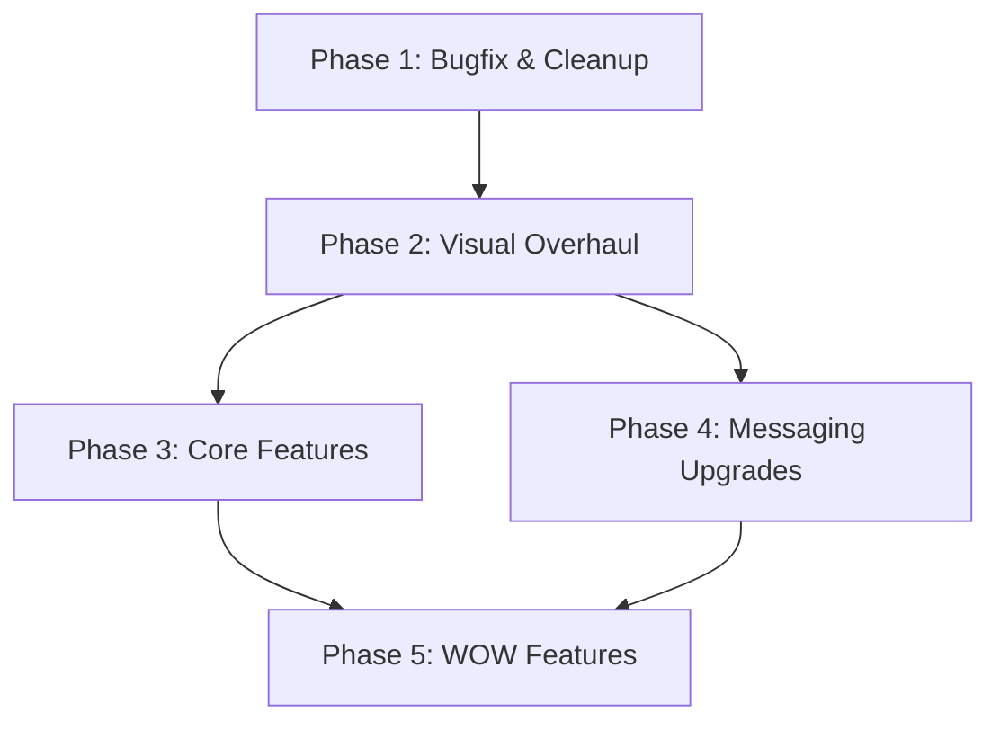

# NhanZ Chat App — Full Implementation Plan

> **Version:** 1.0  
> **Created:** 2026-10-01  
> **Status:** Planning  
> **Goal:** Transform NhanZ from a basic chat prototype into a premium, production-ready messaging app.

---

## 📐 Architecture Overview

```
NhanZ/ (Turborepo + pnpm)
├── apps/
│   ├── web/          → React 19 + Vite + TailwindCSS v4 + Shadcn/ui
│   └── server/       → Express + Socket.io + Prisma + PostgreSQL
├── packages/
│   └── shared/       → Zod schemas, types, constants (ESM)
└── docs/             → This plan directory
```

---

## 🎯 Success Criteria

| Metric | Before | After |
|--------|--------|-------|
| Visual quality | Generic Shadcn starter | Premium dark-themed app |
| Bugs | 10 known issues | 0 critical bugs |
| Dark mode | CSS exists, no toggle | Fully working toggle |
| Animations | Minimal | Micro-animations throughout |
| Features | Basic 1-1 chat | Reactions, file sharing, groups, presence |
| Auth security | `x-user-id` header hack | Proper JWT middleware |

---

## 📦 Phase Map

| Phase | Document | Scope | Priority |
|-------|----------|-------|----------|
| **Phase 1** | [`01-bugfix-cleanup.md`](./01-bugfix-cleanup.md) | Fix all 10 bugs, remove dead code, clean boilerplate | 🔴 Critical |
| **Phase 2** | [`02-visual-overhaul.md`](./02-visual-overhaul.md) | New dark theme, redesigned auth pages, sidebar, chat area | 🔴 Critical |
| **Phase 3** | [`03-core-features.md`](./03-core-features.md) | Dark mode toggle, unread badges, online presence, group chat UI | 🟡 High |
| **Phase 4** | [`04-messaging-upgrades.md`](./04-messaging-upgrades.md) | Message reactions, edit/delete, image sharing, voice messages | 🟡 High |
| **Phase 5** | [`05-wow-features.md`](./05-wow-features.md) | AI assistant, video calls, theme studio, E2E encryption | 🟢 Future |

---

## 🛠 Design Decisions

### Theme: "Midnight Ocean"
- **Base**: Deep charcoal/navy (`#0f1419`, `#1a1f2e`)
- **Accent**: Cyan-teal gradient (`#06b6d4` → `#0ea5e9`)
- **Warning**: Warm amber (`#f59e0b`)
- **Success**: Emerald (`#10b981`)
- **Surface glass**: `rgba(255,255,255,0.05)` with `backdrop-blur`

### Font Stack
- **Primary**: Inter (via Google Fonts or Tailwind default)
- **Mono**: JetBrains Mono (code blocks)

### Animation Strategy
- `framer-motion` for page transitions and message entrance
- CSS transitions for hover/focus states (60fps)
- `tailwindcss-animate` for simple utility animations
- Reduced motion respect: `@media (prefers-reduced-motion: reduce)`

---

## 📋 Dependency Graph



> **Phase 1 → Phase 2** is sequential (must fix bugs before redesign).  
> **Phase 3 & 4** can run in parallel after Phase 2.  
> **Phase 5** depends on both 3 and 4.

---

## 📁 Files Index

All plan documents live in `docs/`:

```
docs/
├── 00-overview.md          ← You are here
├── 01-bugfix-cleanup.md    ← Bug fixes & dead code removal
├── 02-visual-overhaul.md   ← Theme, auth pages, sidebar, chat redesign
├── 03-core-features.md     ← Dark mode, presence, unread, groups
├── 04-messaging-upgrades.md← Reactions, edit/delete, file sharing
└── 05-wow-features.md      ← AI, video calls, theme studio
```
